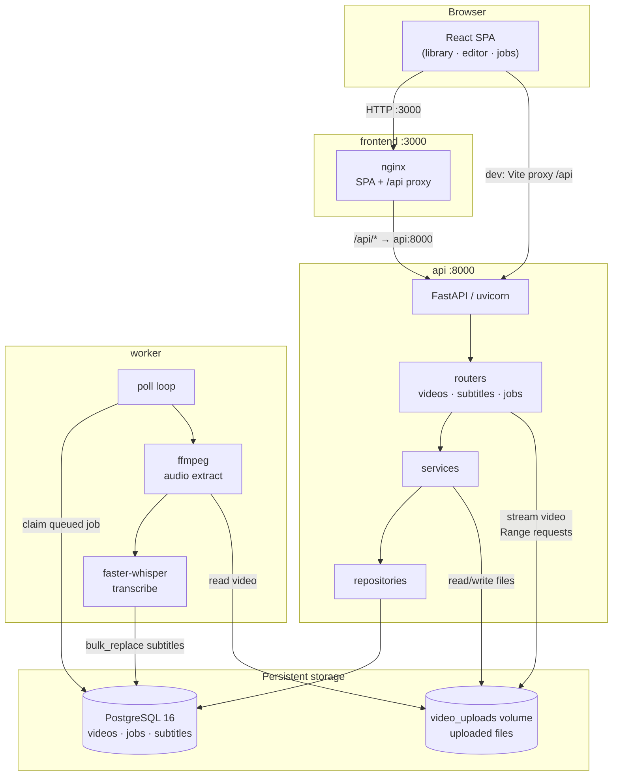
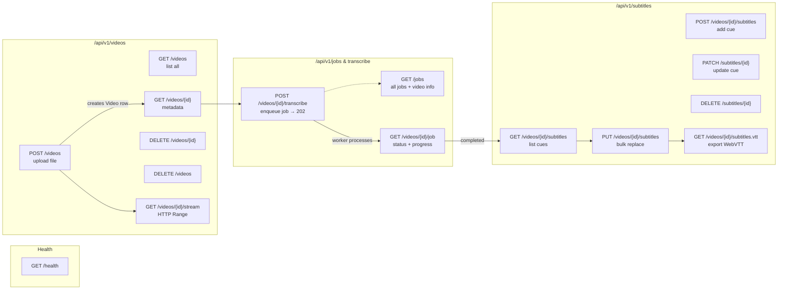
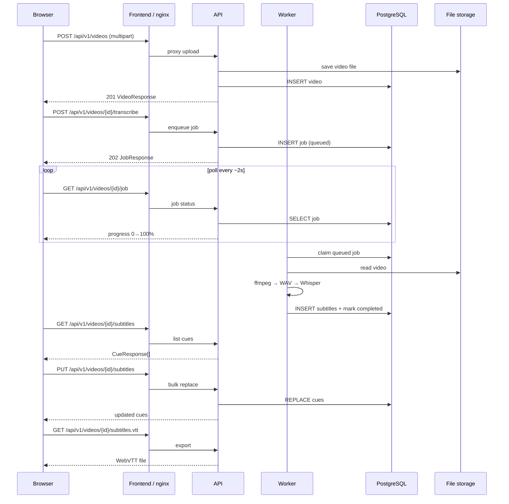
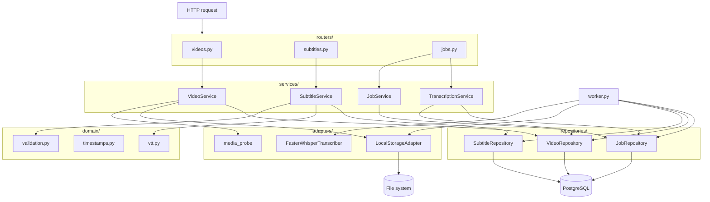
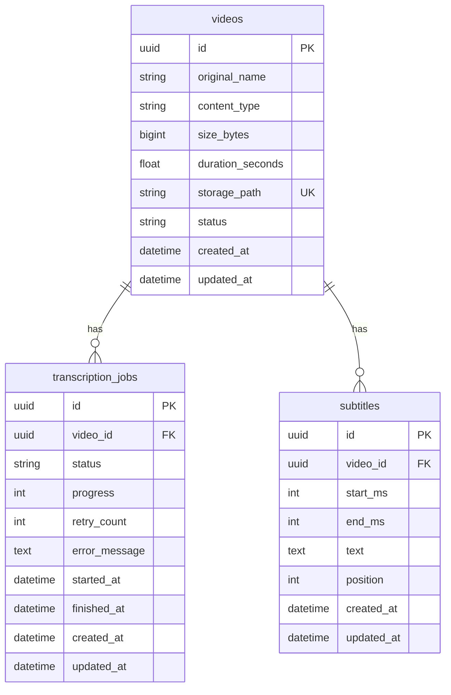

# Architecture

System design reference — flows, diagrams, and project structure.

For setup, testing, and API usage see [README.md](./README.md).

---

## Table of contents

1. [High-level design](#high-level-design)
2. [API flow](#api-flow)
3. [User journey flow](#user-journey-flow)
4. [Backend internal flow](#backend-internal-flow)
5. [Worker flow](#worker-flow)
6. [Project structure](#project-structure)
7. [Database schema](#database-schema)
8. [Design decisions](#design-decisions)

---

## High-level design

A browser-based tool for uploading video, auto-generating subtitles with Whisper, editing cues synced to playback, and exporting WebVTT. Four Docker services — **frontend**, **api**, **worker**, **db** — share persistent Postgres and a file volume.

### Pipeline

| Step | Action | Technology |
|------|--------|------------|
| 1 | Upload a video | React dropzone → FastAPI multipart upload |
| 2 | Transcribe speech | Background worker → ffmpeg + faster-whisper |
| 3 | Edit subtitle cues | Browser editor synced to `<video>` playback |
| 4 | Export subtitles | WebVTT download |

Supported formats: MP4, MOV, AVI, MKV, WebM.

### System architecture



| Service | Port | Role |
|---------|------|------|
| frontend | 3000 | React SPA, proxies `/api/` to API |
| api | 8000 | REST API + OpenAPI docs |
| worker | — | Background transcription |
| db | internal | PostgreSQL 16 |

The API handles synchronous requests (upload, CRUD, streaming). Long-running transcription runs in the worker, which polls Postgres for queued jobs, extracts audio with ffmpeg, runs faster-whisper, and writes subtitle cues back to the database.

### Backend layers

`routers → services → repositories → adapters`

| Layer | Role |
|-------|------|
| Routers | HTTP routing, Pydantic request/response mapping |
| Services | Business rules — validation, job enqueue, cue CRUD |
| Repositories | Async SQLAlchemy queries |
| Adapters | Filesystem, ffprobe, Whisper (external I/O) |
| Domain | Pure helpers — VTT format, timestamps, validation |

Pydantic schemas are kept separate from SQLAlchemy ORM models. See [Design decisions](#design-decisions) at the end of this document for rationale on these choices.

---

## API flow

All REST endpoints grouped by resource, with typical call order.



### Happy-path sequence



---

## User journey flow

How the three frontend screens map to API calls.


---

## Backend internal flow

Request path through the Python layers.



---

## Worker flow

Background transcription pipeline.


Job `status` lifecycle: `queued` → `processing` → `completed` | `failed`

Corrupted files fail immediately (no retry). Transient errors requeue up to `MAX_JOB_RETRIES`.

---

## Project structure

Complete file tree. Paths relative to `video-subtitling-tool/`.

```
video-subtitling-tool/
│
├── .env.example                 # Environment template
├── docker-compose.yml           # db · api · worker · frontend · test services
├── README.md                    # Setup, testing, API usage
├── architecture.md              # This file
├── PROMPT.md                    # Original project prompt / spec
│
├── test-videos/                 # Manual test fixtures
│   └── corrupted_test.mp4       # Optional ffmpeg corruption test fixture
│
├── backend/
│   ├── Dockerfile               # Multi-stage Python 3.12 image (ffmpeg included)
│   ├── pyproject.toml           # Package metadata, dev deps, tool config
│   ├── requirements.txt         # Runtime deps for Docker image
│   ├── conftest.py              # Adds backend/ to sys.path for pytest
│   ├── alembic.ini              # Alembic configuration
│   │
│   ├── alembic/
│   │   ├── env.py               # Async migration runner
│   │   └── versions/
│   │       ├── 0001_initial.py          # videos, transcription_jobs, subtitles
│   │       └── 0002_add_retry_count.py  # retry_count on jobs
│   │
│   ├── app/
│   │   ├── main.py              # FastAPI app factory, CORS, error handlers
│   │   ├── config.py            # Pydantic settings
│   │   ├── db.py                # Async SQLAlchemy engine, session, Base
│   │   ├── models.py            # ORM: Video, TranscriptionJob, Subtitle
│   │   ├── errors.py            # AppError hierarchy
│   │   ├── worker.py            # Background transcription worker
│   │   │
│   │   ├── routers/
│   │   │   ├── videos.py        # CRUD, upload, HTTP Range streaming
│   │   │   ├── subtitles.py     # CRUD cues, bulk replace, VTT export
│   │   │   └── jobs.py          # Transcribe enqueue, job status, list jobs
│   │   │
│   │   ├── services/
│   │   │   ├── video_service.py
│   │   │   ├── subtitle_service.py
│   │   │   ├── transcription_service.py
│   │   │   └── job_service.py
│   │   │
│   │   ├── repositories/
│   │   │   ├── video_repo.py
│   │   │   ├── subtitle_repo.py
│   │   │   ├── job_repo.py            # Atomic claim_queued, progress updates
│   │   │   └── fakes.py               # In-memory fakes for unit tests
│   │   │
│   │   ├── adapters/
│   │   │   ├── storage.py             # LocalStorageAdapter
│   │   │   ├── media_probe.py         # ffprobe duration detection
│   │   │   └── transcription.py       # FasterWhisperTranscriber
│   │   │
│   │   ├── domain/
│   │   │   ├── vtt.py                 # WebVTT serialization
│   │   │   ├── timestamps.py          # ms ↔ VTT timestamp conversion
│   │   │   └── validation.py          # Cue overlap / ordering rules
│   │   │
│   │   └── schemas/
│   │       ├── video_schemas.py
│   │       ├── subtitle_schemas.py
│   │       └── job_schemas.py
│   │
│   └── tests/
│       ├── integration/
│       │   ├── test_upload_api.py
│       │   ├── test_subtitle_api.py
│       │   └── test_e2e.py
│       └── unit/
│           ├── test_corrupted_file.py
│           ├── test_repositories.py
│           ├── test_subtitle_service.py
│           ├── test_timestamps.py
│           ├── test_transcription_service.py
│           ├── test_validation.py
│           ├── test_video_service.py
│           ├── test_vtt.py
│           └── test_worker.py
│
└── frontend/
    ├── Dockerfile               # builder (Node 20) → runtime (nginx)
    ├── nginx.conf               # SPA fallback + /api/ proxy
    ├── index.html
    ├── package.json
    ├── vite.config.ts           # Dev server, /api proxy, Vitest config
    │
    └── src/
        ├── main.tsx
        ├── App.tsx              # library · editor · jobs screens
        ├── api/client.ts        # Axios client + TypeScript types
        ├── hooks/
        │   ├── useLibrary.ts
        │   └── useEditorSession.ts
        ├── components/
        │   ├── UploadZone.tsx
        │   ├── VideoPlayer.tsx
        │   ├── SubtitleEditor.tsx
        │   ├── CueRow.tsx
        │   ├── ExportButton.tsx
        │   ├── JobsMonitor.tsx
        │   └── shared/          # Header, VideoCard, ProgressBar, …
        ├── styles/theme.ts
        └── utils/format.ts
```

---

## Database schema



---

## Design decisions

This section explains the main architectural and API choices — what we picked, what we rejected, and why. The goal is a backend that is easy to test, reason about, and extend toward production without over-engineering a take-home scope.

### Layered backend (`routers → services → repositories → adapters`)

**Choice:** Four explicit layers with Pydantic schemas separate from SQLAlchemy models.

**Why:** Routers stay thin — they map HTTP to service calls and commit transactions. Services hold business rules (duplicate-job guard, cue validation, enqueue logic) without knowing about FastAPI or SQL syntax. Repositories isolate all database access so queries can change without touching HTTP or domain logic. Adapters wrap external I/O (filesystem, ffmpeg, Whisper) behind protocols.

**Rejected:** Fat routers with inline SQL, or a single "models + endpoints" structure. That works for a demo but makes unit testing painful and couples HTTP concerns to persistence.

**Payoff:** Unit tests inject `FakeVideoRepository`, `FakeJobRepository`, etc. Integration tests override FastAPI dependencies with fakes — no Postgres or disk required for most of the suite (89 tests, ~1 s).

---

### Separate worker process

**Choice:** Transcription runs in a dedicated `worker` container, not inside the API process.

**Why:** Whisper inference is CPU/GPU-bound and can run for minutes. Keeping it out of the API keeps upload/list/edit endpoints responsive under load and lets you scale workers independently (e.g. one API, N workers) without changing code.

**Rejected:** Running transcription in a FastAPI `BackgroundTasks` handler or thread pool. Simpler to deploy, but a single long job blocks resources in-process, restarts kill in-flight work silently, and you cannot scale compute separately from the web tier.

**Production path:** Same pattern extends to a managed queue (SQS, Redis) — only the transport changes; services and repositories stay the same.

---

### Database-backed job queue with polling

**Choice:** Jobs are rows in `transcription_jobs`. The worker polls with `claim_queued()` — an atomic `UPDATE … RETURNING` that sets the oldest `queued` row to `processing`.

**Why:** One dependency (Postgres), no Redis/Celery/RabbitMQ to operate. Claiming via SQL gives exactly-once processing per worker without a separate broker. Polling every few seconds is fine for a subtitle tool where jobs are minutes long, not milliseconds.

**Rejected:** Celery + Redis, SQS, or WebSockets for progress. Those are better at high throughput or sub-second latency, but add infrastructure and operational surface area disproportionate to this workload.

**Trade-off accepted:** Polling adds up to `WORKER_POLL_INTERVAL` seconds of idle latency before a new job starts. Acceptable here; would switch to push notifications or a message broker if queue depth or latency became a bottleneck.

---

### Job status via HTTP polling (not WebSockets)

**Choice:** The frontend polls `GET /videos/{id}/job` every ~2 s while a job is active.

**Why:** Matches the worker's pull model, works through nginx without sticky sessions or a WS gateway, and is trivial to debug with curl. Job state already lives in Postgres — polling is just reading it.

**Rejected:** Server-Sent Events or WebSockets for live progress. Better UX at scale, but requires connection management, reconnect logic, and horizontal-scaling considerations the API doesn't need yet.

---

### Retry policy: fail fast on corruption, retry transients

**Choice:** `CorruptedVideoError` (ffmpeg cannot decode the file) → mark `failed` immediately, no retry. Any other exception → requeue up to `MAX_JOB_RETRIES` (default 3), then fail permanently.

**Why:** Corrupted or wrong-format files are deterministic — retrying wastes GPU/CPU and blocks the queue. OOM, model crashes, or transient I/O errors may succeed on a second attempt. The distinction is encoded in `_should_retry()` in the worker, not left to the operator.

**On startup:** `reset_orphaned()` moves any `processing` jobs back to `queued` so a worker crash or deploy doesn't strand jobs forever.

---

### Progress reporting during transcription

**Choice:** Progress is written to the DB at most once per second, capped at 99% until completion. Two heuristics drive the value: segment position (`seg.end_sec / duration`) and a time-elapsed floor (assuming ≤1× real-time).

**Why:** faster-whisper blocks for several seconds during VAD/model warm-up before yielding the first segment — without an immediate 1% write and a time floor, the UI would show 0% for a long stretch. Throttling writes to 1 s avoids hammering Postgres on every segment.

**Trade-off:** Progress is approximate, not byte-accurate. Good enough for a progress bar; exact ETA would need model-specific instrumentation.

---

### Dual subtitle API: granular CRUD + bulk replace

**Choice:** Expose both per-cue endpoints (`POST`, `PATCH`, `DELETE /subtitles/{id}`) and `PUT /videos/{id}/subtitles` to replace the full cue list in one request.

**Why:** The editor reorders, adds, and edits many cues locally before saving. Bulk replace is one round-trip, one transaction, and naturally handles reorder (position is derived from array order). Granular endpoints support scripting, future incremental autosave, and match REST expectations for individual resources.

**Rejected:** PATCH-only or optimistic locking per cue. Correct for real-time collaborative editing; overkill when a single user saves the whole timeline at once.

**Implementation:** `bulk_replace` deletes all cues for the video and inserts the new set in one transaction — simpler than diffing and avoids orphan rows after reorder/delete.

---

### Data model: three tables, explicit job lifecycle

**Choice:** `videos`, `transcription_jobs`, `subtitles` — separate job state from video metadata and from cue content.

**Why:** A video can be uploaded without transcribing. Job status (`queued` → `processing` → `completed` | `failed`), progress, retries, and error messages belong on the job row, not the video. Subtitles are many-to-one with ordered `position` and a DB check constraint `end_ms > start_ms`.

**Rejected:** Storing cues as JSON on the video row. Fewer joins, but loses per-cue IDs for PATCH/DELETE, complicates indexing, and makes partial updates awkward.

**Timestamps:** Cues use integer milliseconds internally (Whisper/ffmpeg output, editor math) and convert to WebVTT timecodes only at export — avoids floating-point drift in the editor.

---

### faster-whisper with configurable model size

**Choice:** Local inference via `faster-whisper` (CTranslate2 backend), default model `small`, overridable via `WHISPER_MODEL`.

**Why:** No external API keys or per-minute cloud billing — the tool runs fully offline in Docker. `small` balances accuracy and speed on CPU for a demo; `tiny`/`base` for faster iteration, `medium`/`large` when quality matters more.

**Rejected:** OpenAI Whisper API or a separate GPU service. Lower ops burden but adds cost, latency, network dependency, and privacy considerations for uploaded video.

**Audio pipeline:** ffmpeg extracts mono 16 kHz PCM WAV before inference — Whisper's expected input regardless of container format (MP4, MKV, etc.).

---

### Local filesystem storage behind a protocol

**Choice:** `LocalStorageAdapter` writes uploads to `STORAGE_DIR/{uuid}/{filename}` behind a `StorageAdapter` protocol. Streaming uses 1 MB chunked reads with HTTP Range support.

**Why:** Zero extra infrastructure for a single-node deployment. The protocol boundary means swapping to S3/MinIO is an adapter change, not a service rewrite. Per-video UUID directories isolate files and simplify delete.

**Rejected:** Storing video bytes in Postgres. Works for tiny files; bad for multi-GB uploads and streaming.

---

### Consistent error model

**Choice:** Application errors extend `AppError` with stable `code`, HTTP status, and optional `details`. FastAPI validation errors map to `validation_error`. Async worker failures surface on the job record (`status: failed`, `error_message`) — not as HTTP 500s on a poll endpoint.

**Why:** Clients can branch on `code` (`duplicate_job`, `invalid_cue`, `video_not_found`) instead of parsing message strings. Separating "request rejected now" (HTTP 4xx) from "background job failed later" (200 + failed job) matches how transcription actually behaves.

---

### Frontend: minimal state, poll where the backend polls

**Choice:** React + TypeScript + Vite, three screens (library, editor, jobs), custom hooks (`useLibrary`, `useEditorSession`) for data fetching and job polling. No global state library.

**Why:** The app's state is mostly server-owned (videos, jobs, cues). Hooks + local `useState` keep data flow obvious. nginx (prod) and Vite (dev) proxy `/api` to the backend so the SPA and API share one origin in Docker.

**Trade-off:** Inline styles instead of a component library — faster to build for a focused tool; would extract a design system if this grew beyond a single product surface.

---

### Testing strategy

**Choice:** Heavy unit coverage on services, domain, and worker logic with in-memory fakes. Integration tests hit real FastAPI routes with dependency overrides (fake repos + fake storage). One optional integration test uses a real corrupted fixture for ffmpeg.

**Why:** Tests must run in CI/Docker without Postgres, GPU, or Whisper model downloads. Fakes prove business logic; integration tests prove routing, status codes, and serialization. Kept separate from E2E against live Whisper — too slow and flaky for every commit.

---

### Intentionally out of scope (production next steps)

These are deliberate omissions for a focused deliverable, not oversights:

| Area | Current state | Likely next step |
|------|---------------|------------------|
| Auth | None — open API | API keys or OAuth; per-user video isolation |
| Health | `GET /health` liveness only | Readiness check: DB + storage writable |
| Observability | Worker logging | Structured logs, metrics (job duration, queue depth), tracing |
| Storage | Local volume | S3-compatible object store + CDN for streaming |
| Queue | Postgres poll | Redis/SQS if throughput or fan-out grows |
| Concurrency | One worker claims one job | Multiple workers safe today via atomic `claim_queued` |
| Rate limiting | None | Upload size + request rate limits at gateway |
