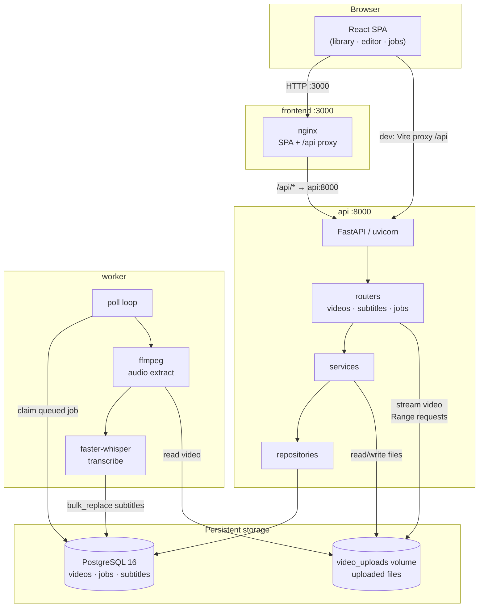
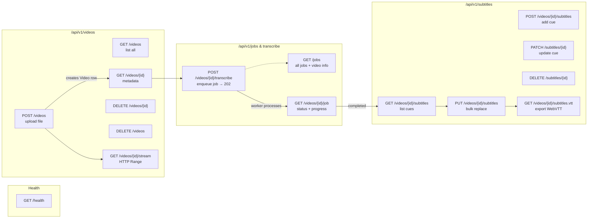
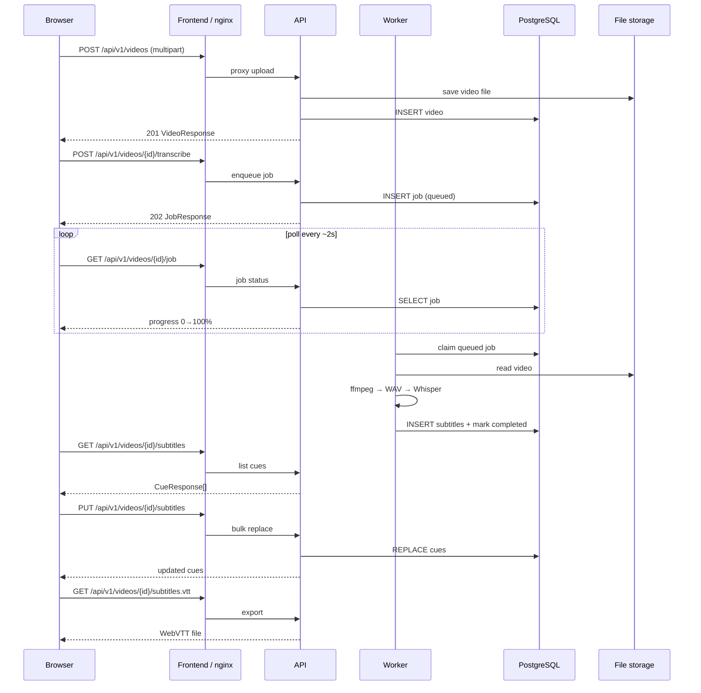
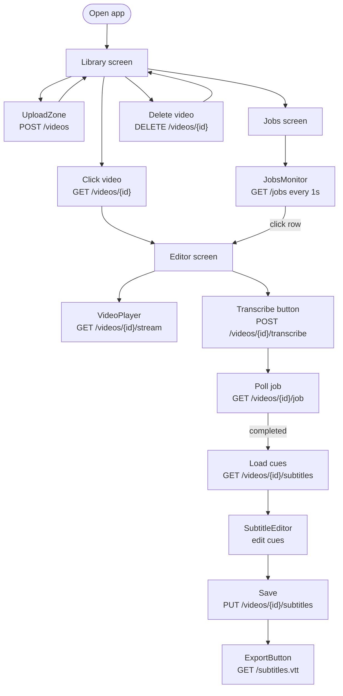
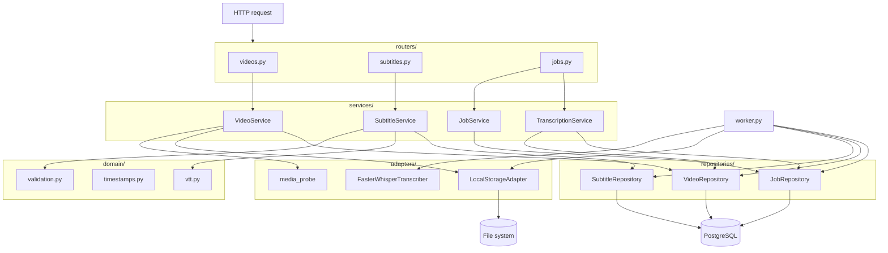
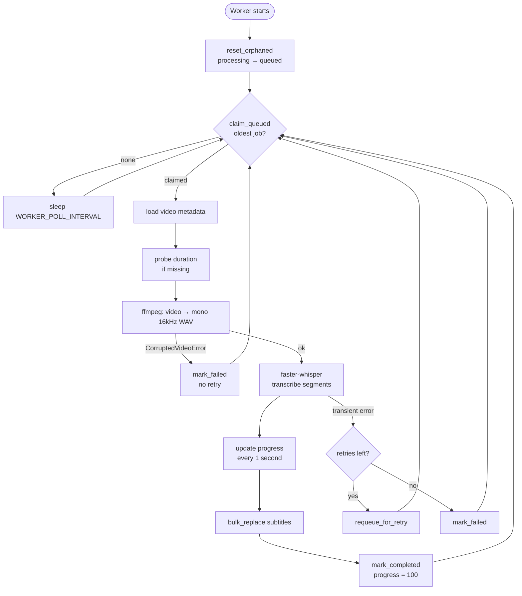
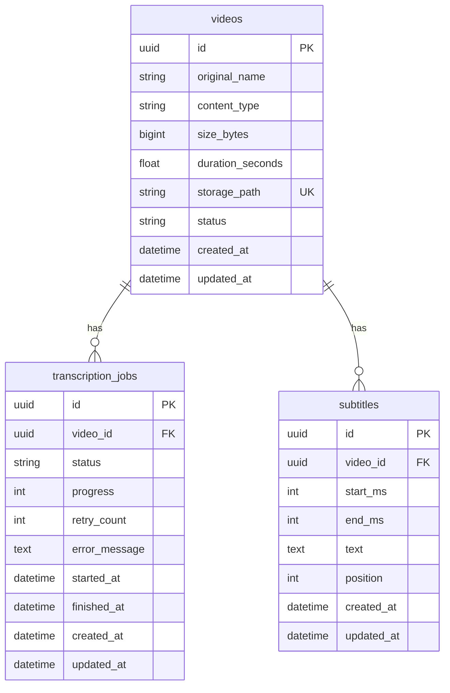

# Architecture

System design reference — flows, diagrams, and project structure.

For setup, testing, and API usage see [README.md](./README.md).

---

## Table of contents

1. [Overview](#overview)
2. [System flow](#system-flow)
3. [API flow](#api-flow)
4. [User journey flow](#user-journey-flow)
5. [Backend internal flow](#backend-internal-flow)
6. [Worker flow](#worker-flow)
7. [Project structure](#project-structure)
8. [Database schema](#database-schema)

---

## Overview

| Step | Action | Technology |
|------|--------|------------|
| 1 | Upload a video | React dropzone → FastAPI multipart upload |
| 2 | Transcribe speech | Background worker → ffmpeg + faster-whisper |
| 3 | Edit subtitle cues | Browser editor synced to `<video>` playback |
| 4 | Export subtitles | WebVTT download |

Supported formats: MP4, MOV, AVI, MKV, WebM.

**Backend layers:** `routers → services → repositories → adapters`

| Layer | Role |
|-------|------|
| Routers | HTTP routing, Pydantic request/response mapping |
| Services | Business rules — validation, job enqueue, cue CRUD |
| Repositories | Async SQLAlchemy queries |
| Adapters | Filesystem, ffprobe, Whisper (external I/O) |
| Domain | Pure helpers — VTT format, timestamps, validation |

---

## System flow

How the four Docker services connect and where data lives.



| Service | Port | Role |
|---------|------|------|
| frontend | 3000 | React SPA, proxies `/api/` to API |
| api | 8000 | REST API + OpenAPI docs |
| worker | — | Background transcription |
| db | internal | PostgreSQL 16 |

---

## API flow

All REST endpoints grouped by resource, with typical call order.



### Happy-path sequence



---

## User journey flow

How the three frontend screens map to API calls.



---

## Backend internal flow

Request path through the Python layers.



---

## Worker flow

Background transcription pipeline.



Job `status` lifecycle: `queued` → `processing` → `completed` | `failed`

Corrupted files fail immediately (no retry). Transient errors requeue up to `MAX_JOB_RETRIES`.

---

## Project structure

Complete file tree. Paths relative to `video-subtitling-tool/`.

```
video-subtitling-tool/
│
├── .env.example                 # Environment template
├── docker-compose.yml           # db · api · worker · frontend · test services
├── README.md                    # Setup, testing, API usage
├── architecture.md              # This file
├── PROMPT.md                    # Original project prompt / spec
│
├── test-videos/                 # Manual test fixtures
│   └── corrupted_test.mp4       # Optional ffmpeg corruption test fixture
│
├── backend/
│   ├── Dockerfile               # Multi-stage Python 3.12 image (ffmpeg included)
│   ├── pyproject.toml           # Package metadata, dev deps, tool config
│   ├── requirements.txt         # Runtime deps for Docker image
│   ├── conftest.py              # Adds backend/ to sys.path for pytest
│   ├── alembic.ini              # Alembic configuration
│   │
│   ├── alembic/
│   │   ├── env.py               # Async migration runner
│   │   └── versions/
│   │       ├── 0001_initial.py          # videos, transcription_jobs, subtitles
│   │       └── 0002_add_retry_count.py  # retry_count on jobs
│   │
│   ├── app/
│   │   ├── main.py              # FastAPI app factory, CORS, error handlers
│   │   ├── config.py            # Pydantic settings
│   │   ├── db.py                # Async SQLAlchemy engine, session, Base
│   │   ├── models.py            # ORM: Video, TranscriptionJob, Subtitle
│   │   ├── errors.py            # AppError hierarchy
│   │   ├── worker.py            # Background transcription worker
│   │   │
│   │   ├── routers/
│   │   │   ├── videos.py        # CRUD, upload, HTTP Range streaming
│   │   │   ├── subtitles.py     # CRUD cues, bulk replace, VTT export
│   │   │   └── jobs.py          # Transcribe enqueue, job status, list jobs
│   │   │
│   │   ├── services/
│   │   │   ├── video_service.py
│   │   │   ├── subtitle_service.py
│   │   │   ├── transcription_service.py
│   │   │   └── job_service.py
│   │   │
│   │   ├── repositories/
│   │   │   ├── video_repo.py
│   │   │   ├── subtitle_repo.py
│   │   │   ├── job_repo.py            # Atomic claim_queued, progress updates
│   │   │   └── fakes.py               # In-memory fakes for unit tests
│   │   │
│   │   ├── adapters/
│   │   │   ├── storage.py             # LocalStorageAdapter
│   │   │   ├── media_probe.py         # ffprobe duration detection
│   │   │   └── transcription.py       # FasterWhisperTranscriber
│   │   │
│   │   ├── domain/
│   │   │   ├── vtt.py                 # WebVTT serialization
│   │   │   ├── timestamps.py          # ms ↔ VTT timestamp conversion
│   │   │   └── validation.py          # Cue overlap / ordering rules
│   │   │
│   │   └── schemas/
│   │       ├── video_schemas.py
│   │       ├── subtitle_schemas.py
│   │       └── job_schemas.py
│   │
│   └── tests/
│       ├── integration/
│       │   ├── test_upload_api.py
│       │   ├── test_subtitle_api.py
│       │   └── test_e2e.py
│       └── unit/
│           ├── test_corrupted_file.py
│           ├── test_repositories.py
│           ├── test_subtitle_service.py
│           ├── test_timestamps.py
│           ├── test_transcription_service.py
│           ├── test_validation.py
│           ├── test_video_service.py
│           ├── test_vtt.py
│           └── test_worker.py
│
└── frontend/
    ├── Dockerfile               # builder (Node 20) → runtime (nginx)
    ├── nginx.conf               # SPA fallback + /api/ proxy
    ├── index.html
    ├── package.json
    ├── vite.config.ts           # Dev server, /api proxy, Vitest config
    │
    └── src/
        ├── main.tsx
        ├── App.tsx              # library · editor · jobs screens
        ├── api/client.ts        # Axios client + TypeScript types
        ├── hooks/
        │   ├── useLibrary.ts
        │   └── useEditorSession.ts
        ├── components/
        │   ├── UploadZone.tsx
        │   ├── VideoPlayer.tsx
        │   ├── SubtitleEditor.tsx
        │   ├── CueRow.tsx
        │   ├── ExportButton.tsx
        │   ├── JobsMonitor.tsx
        │   └── shared/          # Header, VideoCard, ProgressBar, …
        ├── styles/theme.ts
        └── utils/format.ts
```

---

## Database schema


